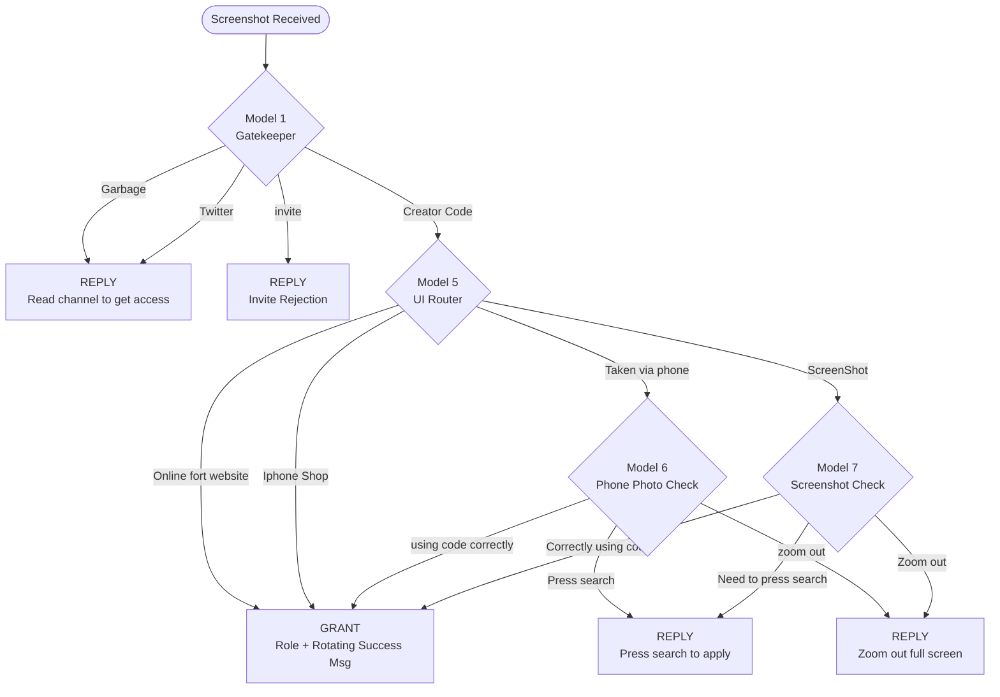
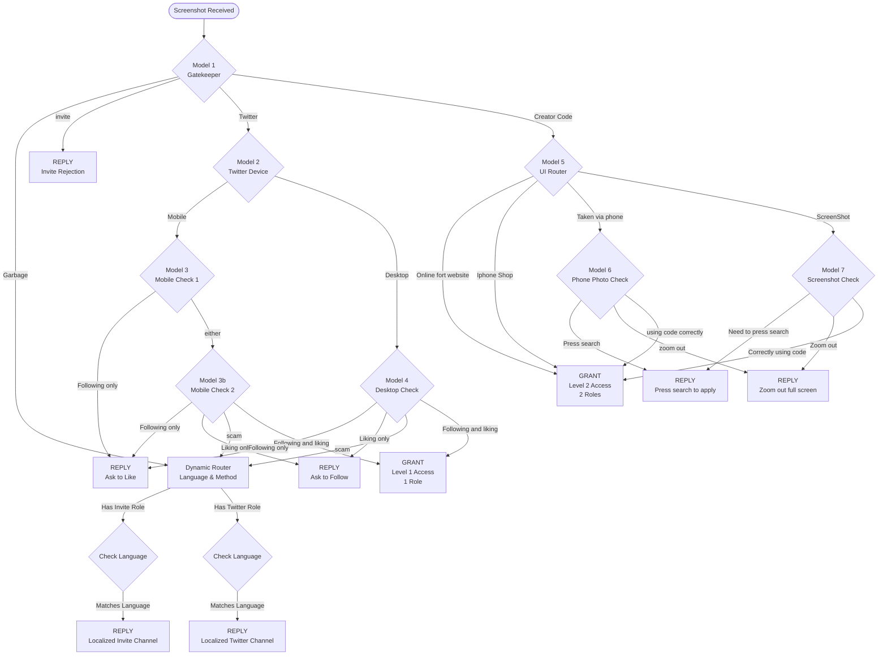

# Proof Automation System Overhaul — Detailed Plan

## Goal

Replace the single-model YOLO classifier in the Wave Logistics Bot (`-z`) with a cascading multi-model decision tree, while preserving the stolen proof detection system and upgrading its logging from Discord embeds to a local database table.

---

## 1. Clean Architecture Rebuild & Archival Strategy

Before we change any code, we will archive the old system to ensure nothing is lost. We will then rebuild using Clean Architecture principles to separate concerns, increase modularity, and reduce coupling.

### Archiving the Old System
- We will create a new directory structure: `old code/old automation project/`
- We will copy `Tasks/proof_automation_tasks.py` and `Commands/proof_automation_commands.py` into this folder.
- We will create a `removed_logic.md` file in this folder explaining the old database schema (`stolen_flags`, old config tables) and the old single-model YOLO logic.

### Clean Architecture Principles
Right now, `proof_automation_tasks.py` is a 1,400+ line monolith that handles Discord events, database operations, image downloading, hashing, AND neural network inference/routing. 

**The Rebuild:**
1. **Discord Presentation Layer (`Tasks/proof_automation_tasks.py`)**: Will ONLY handle listening to Discord messages, downloading images, and sending the final replies/roles.
2. **Data Layer (`Database/`)**: Will handle the new `stolen_detections` table and `GUILD_CONFIG` state.
3. **Business Logic Layer (`utils/automation_tree.py` [NEW])**: The monolithic if/else chain will be replaced by a clean Node-based state machine. Each model will be a `Node` that loads its weights, runs inference, and returns a `Decision` (either routing to another node, or returning a Terminal Action). 
   - *Why?* This massively reduces coupling. If we want to add Model 8 tomorrow, we just add a new Node to the tree without touching the Discord code.

---

## 2. What Gets Ripped Out

### Files modified
- [Tasks/proof_automation_tasks.py](file:///Users/kierenpatel/Downloads/wave-logistics-bot-master/Tasks/proof_automation_tasks.py) (1416 lines) — gut the classification pipeline and embed posting, keep stolen detection + fingerprinting
- [Commands/proof_automation_commands.py](file:///Users/kierenpatel/Downloads/wave-logistics-bot-master/Commands/proof_automation_commands.py) (166 lines) — rebuild for new system (imports `GUILD_CONFIG` from the tasks file)

### Files deleted
- `weights/proof_best.pt` — the old single classifier (replaced by multiple specialized models)

### Code removed from `proof_automation_tasks.py`

| What | Lines | Why |
|---|---|---|
| `_get_yolo()` lazy loader | ~303-321 | Replaced by multi-model loader |
| `_run_yolo()` single inference | ~686-699 | Replaced by cascade runner |
| `_run_yolo_batch()` batched inference | ~702-717 | Replaced by cascade runner |
| `CLASS_NAMES` dict (0-7) | ~128-141 | Old flat class map, no longer applies |
| `CLASS_CONF_THRESHOLD` dict | ~146-156 | Old per-class thresholds |
| `SCAM_*` constants | ~158-165 | Scam handled differently in new tree |
| `CREATOR_CODE_CLASS`, `MULTI_IMAGE_SUPPRESSED_CLASSES` | ~169-175 | Old class-based logic |
| `TRAINING_LOG_MIN_CONF` | ~182 | Old near-miss logging |
| `_post_stolen_review()` | ~791-953 | Embed posting to channels → replaced by DB logging |
| `_post_scam_alert()` | ~955-985 | Embed posting → removed |
| `_post_heads_up()` | ~987-1018 | Embed posting → removed |
| `_build_comparison_jpg()` | ~613-645 | Side-by-side image for embeds → removed |
| `_fetch_original_image_bytes()` | ~765-789 | Fetching original for comparison embed → removed |
| Scoring/action logic in `_process_images` | ~1238-1377 | The if/elif chain on class IDs 0, 3, 4, 5 → replaced by work tree |
| `STAFF_REVIEW_CHANNEL_ID` | ~114 | No longer posting embeds |
| `COPY_PROOF_CHANNEL_ID` | ~116 | No longer posting embeds |
| `PERCEPTUAL_LOG_CHANNEL_ID` | ~119 | No longer posting embeds |
| `_get_staff_channel()` / `_get_copy_proof_channel()` | ~759-763 | Channel helpers for embed posting |

### Constants removed
- `HEADS_UP_MIN_CONF` — old low-confidence threshold for staff heads-up
- `SCAM_CLASS`, `SCAM_CONF_THRESHOLD`, `SCAM_ALERT_ENABLED`, `SCAM_DELETE_ENABLED`, `SCAM_ALERT_CHANNEL_ID`

---

## 3. What Stays (Do Not Touch)

### Stolen proof detection (model-agnostic)

| Function / Block | Lines | Purpose |
|---|---|---|
| `_find_exact_stolen()` | ~428-477 | SHA-256 + attachment ID check against DB |
| `_find_fuzzy_stolen()` | ~480-551 | pHash near-duplicate check (+ mirror) |
| `_store_submission()` | ~554-572 | Store fingerprints in `proof_submissions` |
| `_record_flag_and_count()` | ~575-592 | Record flag in `stolen_flags`, return prior counts |
| `_compute_phash()` | ~596-602 | 256-bit perceptual hash |
| `_compute_phash_flip()` | ~604-611 | Mirrored pHash for flip evasion |
| `_compute_sha256()` | ~647-658 | SHA-256 file hash |
| `_extract_exif()` | ~660-683 | EXIF metadata extraction |
| `STOLEN_MSG` | ~122-126 | Warning message sent to user on exact match |
| All stolen detection switches | ~66-99 | `STOLEN_CHECKS_ENABLED`, `EXACT_STOLEN_ENABLED`, etc. |
| `PHASH_HASH_SIZE`, `PHASH_DUPE_THRESHOLD` | ~62-64 | pHash config |
| `GENERIC_FILENAMES` | ~105-111 | Filename filter set |

### Download & fingerprint pipeline

| Function / Block | Lines | Purpose |
|---|---|---|
| `_download_and_fingerprint()` | ~1080-1122 | Phase 1: download image + cheap fingerprints |
| `_store_fingerprints_only()` | ~1047-1062 | Fingerprint-only path (when automation toggled off) |
| `_collect_fingerprints()` | ~1064-1078 | Collector path wrapper |
| `_is_image()` | ~739-741 | Check if attachment is an image |
| `_safe_unlink()` | ~744-750 | Temp file cleanup |
| `IMAGE_EXTENSIONS` | ~736 | Allowed extensions |

### Action helpers (reusable)

| Function | Lines | Purpose |
|---|---|---|
| `_assign_creator_roles()` | ~1383-1402 | Grant roles to member — reused by new tree |
| `_safe_reply()` | ~1404-1408 | Safe message reply wrapper |

### Pipeline entry & orchestration

| Function / Block | Lines | Purpose |
|---|---|---|
| `on_message()` | ~1020-1045 | Entry point — watches channels, filters bots/non-image |
| Phase 1 download in `_process_images` | ~1173-1177 | Download all images |
| Phase 2 exact stolen check | ~1182-1203 | SHA-256/attachment check before any classification |
| Phase 5 store submissions | ~1228-1236 | Always store fingerprints |

### DB schema

| Table | Purpose | Stays? |
|---|---|---|
| `proof_submissions` | Fingerprint storage for all images | ✅ |
| `proof_automation_state` | Toggle state + creator code message index per guild | ✅ |
| `stolen_flags` | Per-user flag history (count only) | ✅ |

### Separate systems (completely untouched)

| File | System |
|---|---|
| [Tasks/proof.py](file:///Users/kierenpatel/Downloads/wave-logistics-bot-master/Tasks/proof.py) | Proof archival (staff-triggered image saving to `proof_assets/`) |
| [Commands/proof_commands.py](file:///Users/kierenpatel/Downloads/wave-logistics-bot-master/Commands/proof_commands.py) | Proof archival config commands |
| `proof_config` table | Archival configuration |
| `proof_saved_messages` table | Archival dedup tracking |

### Cog loading in Main.py

[Lines 442-444](file:///Users/kierenpatel/Downloads/wave-logistics-bot-master/Main.py#L442-L444) — same extension paths, no changes needed:
```python
await bot.load_extension("Tasks.proof")
await bot.load_extension("Tasks.proof_automation_tasks")
await bot.load_extension("Commands.proof_automation_commands")
```

---

## 4. New: `stolen_detections` Table

Replace the Discord embed logging with a local DB table that captures all the rich forensic data.

### Schema

```sql
CREATE TABLE IF NOT EXISTS stolen_detections (
    id                    INTEGER PRIMARY KEY AUTOINCREMENT,
    guild_id              INTEGER NOT NULL,
    user_id               INTEGER NOT NULL,
    message_id            INTEGER NOT NULL,
    kind                  TEXT NOT NULL,        -- 'exact' or 'perceptual'
    match_type            TEXT,                 -- 'SHA-256', 'attachment reuse', 'pHash', 'pHash (mirrored)'
    original_user_id      INTEGER,
    original_guild_id     INTEGER,
    original_message_id   INTEGER,
    original_submitted_at REAL,
    original_filename     TEXT,
    distance              INTEGER,             -- hamming distance (0 for exact)
    mirror                INTEGER DEFAULT 0,   -- 1 if matched via flipped image
    detail                TEXT,                -- free-text match description
    detected_at           REAL NOT NULL        -- timestamp
);
```

### What writes to it

- Phase 2 (exact stolen check) — on SHA-256 or attachment ID hit
- Phase 4 (perceptual stolen check) — on pHash hit

### What it replaces

- `_post_stolen_review()` embed posting to `1512090290922586272` / `1512346144448188486`
- `_post_scam_alert()` embed posting
- `_post_heads_up()` embed posting

The existing `stolen_flags` table stays as-is for backward compatibility (it's a simple count tracker). `stolen_detections` is the rich forensic log.

---

## 5. Per-Server Config

The existing `GUILD_CONFIG` dict stays but gets updated for the new system.

### Current config structure (per guild)

```python
{
    "name": "Server 1 (Wave Drop Maps)",
    "watch_channel_id": 1210798761329295440,
    "active_classes": (0, 3, 4, 5),           # ← ripped (old class IDs)
    "class_priority": (4, 3, 5, 0),           # ← ripped (old class priority)
    "creator_code_role_ids": (1055713830988157039, 1305277560086593546),
    "following_only_msg": "...",
    "press_search_msg": "...",
    "zoom_out_msg": "...",
    "creator_code_messages": [...],            # 5 rotating unlock messages
    "invite_support_role_name": "Support",     # Role name to ping for invite rejection
    "hitl_review_channel_id": 1516673791844155392, # Channel to post failures < 0.99
}
```

### What stays in guild config
- `name`, `watch_channel_id` — unchanged
- `creator_code_role_ids` — unchanged, used by `_assign_creator_roles`
- `following_only_msg`, `press_search_msg`, `zoom_out_msg` — unchanged, used by leaf actions
- `creator_code_messages` — unchanged, 5 rotating grant messages

### What gets ripped from guild config
- `active_classes` — old flat class IDs, no longer relevant
- `class_priority` — old class priority ordering

### What may need adding
- Any new tree-specific config per server (TBD when work tree is defined)
- Server 2 currently has no Twitter classes — the tree needs to know what to do when Model 1 routes a Server 2 image to Twitter

### Server reference

| Server | Guild ID | Watch Channel | Creator Code Roles | HITL Review Channel |
|---|---|---|---|---|
| Wave Drop Maps | `988564962802810961` | `1210798761329295440` | `1055713830988157039`, `1305277560086593546` | `1516685472720621608` |
| Loot Routes | `971731167621574666` | `1188088624345002035` | `1105873031450075227` | `1516673791844155392` |

#### Loot Routes Garbage Message Logic
For Loot Routes, the Garbage branch (which catches Garbage, Twitter, and anything < 0.99) sends a dynamic reply directing the user to read a specific instruction channel to learn how to get access, based on their current roles:
- If user has role `1188092082540261486` → direct them to read `<#1188089464757686322>`
- If user has role `1188090112987377705` → direct them to read `<#1188089932334501980>`
- Format: `"{user.mention}, this is incorrect. Please read {channel.mention} to learn how to get access."`

---

## 6. New Pipeline Flow (Phases)

```
Image arrives in watch channel
  │
  ├─ Phase 1: Download + cheap fingerprints (SHA-256, attachment ID, EXIF)
  │            [UNCHANGED — _download_and_fingerprint]
  │
  ├─ Phase 2: Exact stolen check (SHA-256 / attachment ID vs DB)
  │            [UNCHANGED — _find_exact_stolen]
  │    └─ HIT? → Log to stolen_detections table, warn user, store fingerprints, STOP
  │
  ├─ Phase 3: Compute pHash (+ mirrored pHash)
  │            [UNCHANGED — _compute_phash / _compute_phash_flip]
  │
  ├─ Phase 4: Perceptual stolen check (pHash vs DB)
  │            [DETECTION UNCHANGED — _find_fuzzy_stolen]
  │    └─ HIT? → Log to stolen_detections table (observation only), continue
  │
  ├─ Phase 5: Store fingerprints in proof_submissions
  │            [UNCHANGED — _store_submission]
  │
  └─ Phase 6: Cascading classification work tree
              [NEW — replaces old single-model scoring/action]
              ┌─────────────────────────────────────┐
              │                                     │
              │   TO BE DEFINED — work tree goes    │
              │   here once model inventory and     │
              │   routing logic are specified        │
              │                                     │
              └─────────────────────────────────────┘
```

---

## 7. Cascading Work Tree (Phase 6)

> [!IMPORTANT]
> **This section is intentionally left blank.** The model inventory, routing logic, confidence thresholds, and leaf-node actions will be defined step by step.

### Model inventory

1. **Model 1 (Gatekeeper)**: `model 1.pt`
   - Purpose: Top-level router to determine the domain of the image
   - Rules: 
     - Must hit **>= 0.99 confidence**.
     - If < 0.99, pause and send to HITL Review.
     - **`Garbage`**: Terminal state. Reject & reply with the dynamic Garbage rejection message.
     - **`invite`**: Terminal state. Reject & reply with: *"Hey! To get access via invites, please contact a {SUPPORT_ROLE_PING} member. They will manually verify your invites and grant you the role. Feel free to DM them your proof!"* 
       - *(Note: The bot will dynamically search the server for a role named "Support" (defined in `GUILD_CONFIG`) and insert its `<@&ID>` mention string to successfully ping it).*
     - **`Twitter`**: Routes to Model 2.
     - **`Creator Code`**: Routes to Model 5.
   - *Status: Ready*

2. **Model 2 (Twitter Device Router)**: `Model 2Desktop or mobile.pt`
   - Purpose: Determines if a Twitter screenshot is from Desktop or Mobile.
   - Classes: `Desktop`, `Mobile` (Exact strings TBD)
   - Rules:
     - Must hit **>= 0.99 confidence**.
     - If < 0.99, pause and send to HITL Review.
     - **`Desktop`**: Routes to Model 4.
     - **`Mobile`**: Routes to Model 3.
   - *Status: Awaiting details*

3. **Model 3 (Mobile/iPad Twitter Check 1)**: `Model 3 following or either set cof .7pt`
   - Purpose: First stage check for Mobile/iPad Twitter proofs. to see if they are only following, or if they might be liking/both.
   - Classes: `Following only`, `either`
   - Rules:
     - Must hit **>= 0.99 confidence**.
     - If < 0.99, pause and send to HITL Review.
     - **`Following only`**: Reject & reply with: *"Please show **__proof__** of __**liking**__ the** pinned tweet **https://x.com/Wavedropmaps/status/1896931137722982898 and following https://x.com/Wavedropmaps, send proof in <URL>"*
     - **`either`**: Routes to Model 3b.
   - *Status: Ready*

4. **Model 3b (Mobile Twitter Check 2)**: `model 3.safetensors` (ViT Transformer)
   - Purpose: Final check for mobile proofs to differentiate between just liking and both.
   - Classes: `Following and liking`, `Following only`, `Liking only`, `scam`
   - Rules:
     - Must hit **>= 0.99 confidence**.
     - If < 0.99, pause and send to HITL Review.
     - **`Following only`**: Reject & reply with: *"Please show **__proof__** of __**liking**__ the** pinned tweet **https://x.com/Wavedropmaps/status/1896931137722982898 and following https://x.com/Wavedropmaps, send proof in <URL>"*
     - **`Liking only`**: Reject & reply with: *"Please show **__proof__** of __**following**__ the account https://x.com/Wavedropmaps and liking the **pinned tweet** https://x.com/Wavedropmaps/status/1896931137722982898, send proof in <URL>"* *(Note: `<URL>` uses the dynamic language channel logic from the Garbage message)*
     - **`scam`**: Terminal state. Reject & reply with the dynamic Garbage rejection message.
     - **`Following and liking`**: Success! GRANT Level 1 Access role and reply with a random message from the **Level 1 message rotation**:
       - *Message 1: "✅ Access granted for Named Locations!\n- Check out <#1210768729395437568> **for access to the landmark  + Reload + OG Drop Maps.**"*
       - *Message 2: "Named Locations ✅\n**<#1210768729395437568> → landmark + Reload + OG Drop Maps.**"*
       - *Message 3: "🔓 Named Locations unlocked — **check out <#1210768729395437568> for landmark  + Reload + OG Drop Maps.**"*
   - *Status: Ready*

5. **Model 4 (Desktop Twitter Check)**: `Model 4 desktop twitter.pt`
   - Purpose: All-in-one check for desktop Twitter proofs.
   - Classes: `Following only`, `Liking only`, `Following and liking`, `scam`
   - Rules:
     - Must hit **>= 0.99 confidence**.
     - If < 0.99, pause and send to HITL Review.
     - **`Following only`**: Reject & reply with: *"Please show **__proof__** of __**liking**__ the** pinned tweet **https://x.com/Wavedropmaps/status/1896931137722982898 and following https://x.com/Wavedropmaps, send proof in <URL>"* *(Note: `<URL>` uses the dynamic language channel logic)*
     - **`Liking only`**: Reject & reply with: *"Please show **__proof__** of __**following**__ the account https://x.com/Wavedropmaps and liking the **pinned tweet** https://x.com/Wavedropmaps/status/1896931137722982898, send proof in <URL>"* *(Note: `<URL>` uses the dynamic language channel logic)*
     - **`scam`**: Terminal state. Reject & reply with the dynamic Garbage rejection message (same as Model 1).
     - **`Following and liking`**: Success! GRANT Level 1 Access role and reply with a random message from the **Level 1 message rotation**.
   - *Status: Ready*

6. **Model 5 (UI Router)**: `Model 5 gatekeeper of proofs.pt`
   - Purpose: Separates Fortnite proofs into 4 different UI environments.
   - Classes:
     1. `Online fort website`
     2. `Iphone Shop`
     3. `Taken via phone`
     4. `ScreenShot`
   - Rules: 
     - Must hit **>= 0.99 confidence**.
     - If < 0.99, pause and send to HITL Review.
     - **`Online fort website`**: Terminal state. GRANT Level 2 Access (both roles: `1055713830988157039`, `1305277560086593546`) and send message from the **dedicated Level 2 rotation array**.
     - **`Iphone Shop`**: Terminal state. GRANT Level 2 Access (both roles: `1055713830988157039`, `1305277560086593546`) and send message from the **dedicated Level 2 rotation array**.
     - **`Taken via phone`**: Routes to Model 6.
     - **`ScreenShot`**: Routes to Model 7.
   - *Status: Ready*

3. **Model 6 (Phone Photo Code Check)**: `phone photo code proof.pt`
   - Purpose: Checks the state of the creator code for images taken via phone.
   - Classes: `Press search`, `using code correctly`, `zoom out`
   - Rules:
     - Must hit **>= 0.99 confidence**.
     - If < 0.99, pause and send to HITL Review.
     - **`Press search`**: Reject & reply with: *"You must **press __search__** on the code `WAVEDROPMAPS` in the **Support-A-Creator panel** so it shows as applied. Once done, post your **proof** here: <URL>"*
     - **`zoom out`**: Reject & reply with: *"Please provide **proof** of using **code** `WAVEDROPMAPS` in the **Support-A-Creator panel**. Ensure your screenshot is **__ZOOMED OUT FULL SCREEN__**, then post it here: <URL>"*
     - **`using code correctly`**: Success! GRANT Level 2 Access role and reply with a random message from the **Level 2 message rotation**.
   - *Status: Ready*

4. **Model 7 (Screenshot Code Check)**: `Screenshot code proof.pt`
   - Purpose: Checks the state of the creator code for direct screenshots.
   - Classes: `Need to press search`, `Correctly using code`, `Zoom out`
   - Rules:
     - **`Need to press search`**: Reject & reply with existing `press_search_msg`
     - **`Zoom out`**: Reject & reply with existing `zoom_out_msg`
     - **`Correctly using code`**: Success! GRANT Level 2 Access role and reply with a random message from the **Level 2 message rotation**.
   - *Status: Ready*

*More models to be added...*

### Tree routing logic

**Because the servers have entirely different requirements, the tree logic is split into two distinct workflows:**

#### Workflow A: Loot Routes Server (`971731167621574666`)
*This server only supports Fortnite proof. Twitter proof is rejected.*



#### Workflow B: Wave Drop Maps Server (`988564962802810961`)
*This server supports both Twitter and Fortnite proof.*



### Leaf-node action map

### Dynamic Garbage Routing (Wave Drop Maps)
Because Wave Drop Maps is an international server supporting multiple proof methods, a single generic "Garbage" reply doesn't work. When Model 1 classifies an image as `Garbage` here, it triggers a dynamic router:

1. **Check Proof Method**: The bot checks if the user has the **Twitter Role** (`1210764292719247400`) or the **Invite Role** (`1210764376676634684`).
2. **Check Language**: The bot checks the user's roles against the 7 language roles:
   - English: `1306357759163498496`
   - Spanish: `1483009690291146824`
   - French: `1483009683156369468`
   - German: `1483009677137547415`
   - Italian: `1483009694447702096`
   - Japanese: `1489886259030524025`
   - Polish: `1483009687283826768`
3. **Targeted Reply**: Based on the combination of Method + Language, the bot replies with the localized string and the specific channel mention. 
*(Note: Top channel = Invite, Bottom channel = Twitter in the provided mappings, except for English where the user's label indicated the reverse. We will codify the exact mappings in the database/config).*

*TBD — maps each terminal node to: reply message, role grant, or rejection*

### Model loading strategy

*TBD — lazy loading pattern, file paths, fallback behaviour*

### Per-server tree behaviour differences

*TBD — how Server 1 vs Server 2 handle different branches*

---

## 8. Verification Plan

### Automated
- Model loader test: verify all model files load successfully
- Mock routing test: feed known classifications through the tree, verify correct leaf action
- DB schema test: verify `stolen_detections` table creates and writes correctly
- Stolen detection regression: verify SHA-256 / pHash detection still works after refactor

### Manual
- Dry-run mode: log classification path without replying/granting, review logs
- Submit known sample images (Twitter mobile, Twitter desktop, Fortnite phone, garbage) to watch channels
- Verify correct role grants on valid proofs
- Verify stolen detection still catches re-uploads
- Verify HITL buttons successfully resume a paused pipeline tree.

---

## 9. Human-in-the-Loop (HITL) Fallback System

> [!IMPORTANT]
> **100% Accuracy Goal**: To ensure perfect reliability, *every* model in the pipeline now enforces a strict `0.99` (99%) confidence threshold. If an inference falls below this, the bot immediately halts processing for that image and escalates it to human review.

### Review Channel
All < 0.99 confidence escalations are sent to the specific server's **HITL Review Channel** defined in `GUILD_CONFIG`.

### Discord UI & Architecture
When an image is flagged for review:
1. **The Message**: The bot sends an embed to the review channel containing:
   - The original image (re-uploaded as an attachment).
   - The user who submitted it and the original guild.
   - Which model failed (e.g., "Model 5 - UI Router").
   - The top predicted class and its confidence (e.g., "Top Guess: Taken via phone (82%)").
2. **The View (Buttons)**: A `discord.ui.View` is attached with interactive buttons representing all possible outputs for that specific model. 
   - *Example for Model 1*: Buttons for [Fortnite], [Twitter], [Garbage].
   - *Example for Model 5*: Buttons for [Online fort website], [Iphone Shop], [Taken via phone], [ScreenShot].
   - **Universal Discard Button**: Every view will also include a red [Reject / Discard] button that allows staff to instantly dump the image as Garbage and send the standard rejection message.

### Memory & Disk Optimization (Preventing Deleted Message Errors)
Holding images and execution states in RAM while waiting for humans (who might take hours to click) causes massive memory leaks and crashes upon bot restart. Furthermore, relying entirely on the Discord CDN is risky because **if the user deletes their original message**, the bot won't be able to fetch the image to resume processing.
**Solution**:
- **Staging Folder**: When an image hits < 0.99, the bot saves the image to a local disk folder (e.g., `hitl_pending/`) and logs the file path in a database table alongside the `original_message_id`. This uses zero RAM.
- **24-Hour Cleanup**: A background task will sweep this folder and delete any pending images older than 24 hours to prevent hard drive bloat.
- **The Discord View**: The `discord.ui.View` attached to the Staff Review message will store the database ID or `original_message_id` in its custom payload.

### How Flow Resumes (Following the Diagram to a T)
When a human intervenes by clicking a button, they are acting as an "override oracle". The bot takes their chosen class, treats it as a 100% confident prediction, and seamlessly injects it right back into the diagram exactly where the model paused.
- **Example 1 (Gatekeeper)**: Model 1 hits 60% confidence on Fortnite. The bot pauses and sends it to staff. Staff clicks "Fortnite". The bot immediately resumes the diagram flow, feeding the saved image straight into Model 5.
- **Example 2 (Leaf Node Edge Case)**: Model 6 hits 80% on "using code correctly". Staff clicks "using code correctly". The bot resumes the diagram flow at that exact leaf node, which triggers the `G2` action: it grants the role and sends the rotational success message automatically. The human intervention does not skip steps—it simply provides the correct answer so the bot can follow the diagram perfectly.

### Long-term Training Pipeline
By capturing human button clicks on low-confidence images, the bot effectively creates a perfectly labeled dataset of edge cases. In the future, this data can be automatically exported to fine-tune the YOLO models, continuously shrinking the amount of manual review required over time.

---

## 10. Implementation Status Checklist

> **Audit Date**: 2026-06-17
> **Audit Scope**: Every item in this plan cross-checked against the actual code in the repository.

### Architecture & Archive

| # | Item | Status | Notes |
|---|---|---|---|
| 1 | Archive created at `old code/old automation project/` | ✅ Done | Contains `proof_automation_commands.py`, `proof_automation_tasks.py`, `removed_logic.md` |
| 2 | `removed_logic.md` documents old system | ✅ Done | Covers single-model, embed logging, old flags |
| 3 | `utils/automation_tree.py` — Node-based state machine | ✅ Done | `AutomationTree`, `AutomationNode`, `Decision` classes implemented |
| 4 | `utils/model_nodes.py` — 7 model nodes | ✅ Done | 6 YOLO nodes + 1 ViT node (`Model3bMobileCheck2`) |
| 5 | `utils/automation_handlers.py` — Dynamic handlers | ✅ Done | 7-language × 2-method garbage routing, invite rejection, Loot Routes routing |
| 6 | `Tasks/proof_automation_tasks.py` gutted to presentation layer only | ⚠️ Partial | New tree is wired in, but ~200 lines of dead old constants/functions still remain |
| 7 | `Commands/proof_automation_commands.py` rebuilt for new system | ✅ Done | Imports `GUILD_CONFIG` from tasks, toggle/status commands work |

### Database

| # | Item | Status | Notes |
|---|---|---|---|
| 8 | `stolen_detections` table created | ✅ Done | Exact schema match to plan — in `database_improved.py` `_init_tables()` |
| 9 | `log_stolen_detection()` function | ✅ Done | Defined at line 228, called from both exact and perceptual paths |
| 10 | Exact stolen → writes to `stolen_detections` | ✅ Done | Lines 908-913 in `proof_automation_tasks.py` |
| 11 | Perceptual stolen → writes to `stolen_detections` | ✅ Done | Lines 935-940 in `proof_automation_tasks.py` |
| 12 | Embed posting functions removed (`_post_stolen_review`, `_post_scam_alert`, `_post_heads_up`) | ❌ Not Done | These functions are not present in the current `proof_automation_tasks.py` (they were actually removed), but the old channel ID constants still exist |

### GUILD_CONFIG

| # | Item | Status | Notes |
|---|---|---|---|
| 13 | `active_classes` removed | ✅ Done | |
| 14 | `class_priority` removed | ✅ Done | |
| 15 | `twitter_enabled` added | ✅ Done | `True` for Wave Drop Maps, `False` for Loot Routes |
| 16 | `hitl_review_channel_id` added | ✅ Done | Per-server HITL channels configured |
| 17 | `invite_support_role_name` added | ✅ Done | "Support" for both servers |
| 18 | `creator_code_role_ids` preserved | ✅ Done | |
| 19 | `creator_code_messages` preserved | ✅ Done | 5 rotating messages per server |
| 20 | `following_only_msg`, `press_search_msg`, `zoom_out_msg` preserved | ✅ Done | |

### Model Nodes — Routing Logic

| # | Node | Confidence Threshold | Plan Match | Notes |
|---|---|---|---|---|
| 21 | Model 1 (Gatekeeper) | 0.99 | ✅ | Routes: Garbage→REJECT_DYNAMIC, invite→REJECT_INVITE, Twitter→M2, Creator Code→M5. Loot Routes: Twitter→REJECT_DYNAMIC via `twitter_enabled` check |
| 22 | Model 2 (Twitter Router) | 0.99 | ✅ | Desktop→M4, Mobile→M3a |
| 23 | Model 3a (Mobile Check 1) | 0.99 | ✅ | Following only→REJECT_FOLLOWING_ONLY, either→M3b |
| 24 | **Model 3b (Mobile Check 2)** | **0.70** | ⚠️ | Plan says 0.99, code uses 0.70. Intentional change per latest commit. ViT/safetensors model. |
| 25 | Model 4 (Desktop Check) | 0.99 | ✅ | Following only→REJECT, Liking only→REJECT, scam→REJECT_DYNAMIC, Following and liking→GRANT_LEVEL_1 |
| 26 | Model 5 (UI Router) | 0.99 | ✅ | Online fort website/Iphone Shop→GRANT_LEVEL_2, Taken via phone→M6, ScreenShot→M7 |
| 27 | Model 6 (Phone Photo) | 0.99 | ✅ | Press search→REJECT_PRESS_SEARCH, zoom out→REJECT_ZOOM_OUT, using code correctly→GRANT_LEVEL_2 |
| 28 | **Model 7 (Screenshot)** | **0.99** | ✅ | Confidence threshold added at line 116. `if confidence < 0.99: return HITL` |

### Role Assignment

| # | Item | Status | Notes |
|---|---|---|---|
| 29 | Level 1 grants 1 role | ✅ Done | `_assign_creator_roles` with `level=1` → `role_ids[:1]` |
| 30 | Level 2 grants all roles | ✅ Done | `_assign_creator_roles` with `level=2` → full `role_ids` |
| 31 | **Separate Level 1 / Level 2 message rotations** | ✅ Done | `creator_code_messages_level_1` (5 rotating) and `creator_code_messages_level_2` split in GUILD_CONFIG. ⚠️ Level 2 has placeholder message only. |

### HITL System

| # | Item | Status | Notes |
|---|---|---|---|
| 32 | < 0.99 → HITL escalation | ✅ Done | All YOLO nodes return `HITL` decision |
| 33 | Embed with model info + confidence | ✅ Done | `discord.Embed` with User, Failed Node, Confidence, Predicted Class fields |
| 34 | Interactive buttons for each model's classes | ✅ Done | `HITLReviewView` class — dynamic buttons per model's `class_names` |
| 35 | Universal discard button | ✅ Done | Red "Discard" button, deletes staging file |
| 36 | `hitl_pending/` staging folder | ✅ Done | Created at `hitl_pending/hitl_{message_id}_{uuid}.ext` |
| 37 | 24-hour cleanup task | ✅ Done | `@tasks.loop(hours=24)` with `before_loop` guard |
| 38 | Resume-flow after human click | ✅ Done | `resume_processing()` re-injects with `force_class` |
| 39 | Long-term training pipeline | ❌ Not Done | |

### Model Loading

| # | Item | Status | Notes |
|---|---|---|---|
| 40 | Lazy loading on first `evaluate()` | ✅ Done | |
| 41 | **Model paths correct for deployment** | ✅ Done | Changed to relative `Models/...` paths in `_build_tree()` lines 622-629 |
| 42 | **Model weight files present** | ✅ Done | All 7 model files present in `Models/` directory (6 `.pt` + 1 `.safetensors`) |

### Dead Code Still in Active File

| # | Constant/Function | Plan Says | Actually |
|---|---|---|---|
| 43 | `CLASS_NAMES` dict | Remove | ✅ Removed |
| 44 | `CLASS_CONF_THRESHOLD` dict | Remove | ✅ Removed |
| 45 | `SCAM_CLASS`, `SCAM_CONF_THRESHOLD`, `SCAM_ALERT_ENABLED`, `SCAM_DELETE_ENABLED`, `SCAM_ALERT_CHANNEL_ID` | Remove | ✅ Removed |
| 46 | `CREATOR_CODE_CLASS`, `MULTI_IMAGE_SUPPRESSED_CLASSES` | Remove | ✅ Removed |
| 47 | `TRAINING_LOG_MIN_CONF` | Remove | ✅ Removed |
| 48 | `STAFF_REVIEW_CHANNEL_ID`, `COPY_PROOF_CHANNEL_ID`, `PERCEPTUAL_LOG_CHANNEL_ID` | Remove | ✅ Removed |
| 49 | `HEADS_UP_MIN_CONF` | Remove | ✅ Removed |
| 50 | `_get_ocr()` | Remove | ✅ Removed |
| 51 | `_get_staff_channel()`, `_get_copy_proof_channel()` | Remove | ✅ Removed |
| 52 | `_run_heavy_analysis()` | Remove | ✅ Removed |
| 53 | `_run_yolo_batch` | Remove | ✅ Removed (no longer referenced) |
| 54 | `_yolo_model` global | Remove | ✅ Removed |
| 55 | `_humanize_seconds()` | Remove | ✅ Removed |
| 56 | `_TWITTER_USERNAME_RE` / `_extract_twitter_username()` | Remove | ✅ Removed |
| 57 | `_record_flag_and_count()` | Remove | 🔴 Function EXISTS as method (line 671), but 2 of 4 callers (lines 711, 739) call it as bare `_record_flag_and_count(...)` without `self.` → `NameError`. Lines 721, 749 correctly use `self._record_flag_and_count(...)`. |

### Runtime Bugs

| # | Item | Status | Notes |
|---|---|---|---|
| 57 | `_get_next_creator_msg` callers mismatch | ✅ Fixed | Lines 753, 757 now correctly call `_get_next_creator_code_message(guild_id, "Level 1"/"Level 2")` |
| 58 | `_assign_creator_roles` missing `level` param | ✅ Fixed | Lines 771, 775 now correctly pass `"Level 1"` / `"Level 2"` as third argument. |
| 59 | `_record_flag_and_count` called but deleted | 🔴 **BUG** | Lines 694, 721 call `_record_flag_and_count(...)` but the function was removed in Phase 4 cleanup. `NameError` on any stolen match. |
| 60 | `STOLEN_MSG` has unformatted `{mention}` | 🟡 **BUG** | Line 723 sends literal `"{mention} 🚨 ..."` via `_safe_reply(message, STOLEN_MSG)` without `.format(mention=message.author.mention)`. User won't be pinged. |

### Verification

| # | Item | Status |
|---|---|---|
| 61 | Model loader test | ❌ Not Done |
| 62 | Mock routing test | ❌ Not Done |
| 63 | DB schema test | ❌ Not Done |
| 64 | Stolen detection regression | ❌ Not Done |
| 65 | Dry-run mode | ❌ Not Done |
| 66 | Manual sample image testing | ❌ Not Done |

### Summary

| Category | Done | Partial | Not Done |
|---|---|---|---|
| Architecture & Archive | 5 | 1 | 1 |
| Database | 5 | 0 | 0 |
| GUILD_CONFIG | 9 | 0 | 0 |
| Model Nodes — Routing | 7 | 1 | 0 |
| Role Assignment | 3 | 0 | 0 |
| HITL System | 7 | 0 | 1 |
| Model Loading | 3 | 0 | 0 |
| Dead Code Removal | 12 | 1 | 0 |
| Runtime Bugs | 2 | 0 | 2 |
| Verification | 0 | 0 | 6 |
| **TOTAL** | **53** | **3** | **10** |
