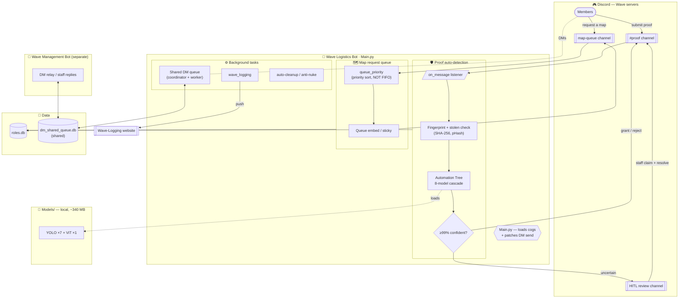

# Wave Logistics Bot — Architecture

> A conceptual map of how the bot fits together. For per-system detail, follow the `AGENTS.md` → Codebase Map into `ai-hub/memory/bot-infrastructure/`.

**Two complementary diagrams:**
1. **System Flow** (below) — How proof submission and map requests flow through the bot
2. **Folder Structure** — Where everything lives in ai-hub/ (see C4 diagram at bottom)

## System Flow Diagram (Mermaid)

This diagram renders directly on GitHub and in most markdown viewers — no tooling needed.

## Legend / how to read it
- **Two front doors:** members either submit a **proof screenshot** (→ proof system) or **request a map** (→ map queue).
- **Proof system:** `on_message` fingerprints the image (SHA-256 + perceptual hash, with a stolen-proof check), runs it through the **Automation Tree** (8 ML models in `Models/`), and acts only at **≥99% confidence** — otherwise it routes to the **HITL review queue** for a human.
- **Map queue:** requests are sorted by **priority tier, not arrival order**, then rendered as an embed/sticky.
- **Cross-bot:** the **shared DM queue** and the **Wave Management Bot** both read/write the same `dm_shared_queue.db` — this is where their automated actions can collide (see `global-memory/context/001-cross-bot-proof-deletion.md`).
- **`Models/`** is local-only (~340 MB, gitignored); **`roles.db`** is the bot's own database.

For the authoritative per-system detail, read the matching doc in `ai-hub/memory/bot-infrastructure/`.

## Folder Structure (C4 Diagram)

For a visual map of the ai-hub/ folder structure and how everything is organized, see `ai-hub-architecture.c4` (LikeC4 format). Renders in most IDEs or view with LikeC4 tooling:
- Complete ai-hub/ hierarchy (memory, skills, research, docs, scripts, plans, gates, deprecated)
- Entry point (AGENTS.md) → all subfolders
- 4 views: full structure, ai-hub detail, memory detail, skills detail
